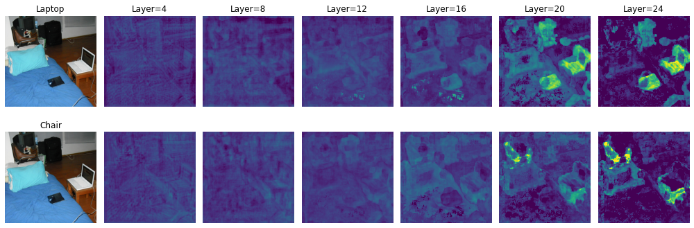

# Latent matching
Latent matching is a class of methods for template matching that uses the latent representations of neural network models. A typical use case is the localization or segmentation of an image based on a given query.

## Semantic matching
Semantic matching model uses text inputs to perform latent matching. Our implementation leverages CLIP in a zero-shot manner.



### Model usage
```python
from PIL import Image
import requests
from smm import SemanticMatchingModel, SemanticMatchingProcessor

model = SemanticMatchingModel.from_pretrained("openai/clip-vit-large-patch14")
processor = SemanticMatchingProcessor.from_pretrained("openai/clip-vit-large-patch14")
model.set_origin(processor)  # set target origin vector

url = "http://images.cocodataset.org/train2017/000000341741.jpg"
image = Image.open(requests.get(url, stream=True).raw)

"""basic resolution (16x16)"""
inputs = processor(
    text=["laptop", "chair"], 
    images=image, return_tensors="pt", padding=True
)
with torch.no_grad():
    outputs = model.get_maps(**inputs)  
    outputs = processor.post_process(outputs) # [n_pair][n_tgt][n_layer,h,w] matching maps

"""higher resolution (224x224)"""
inputs = processor(
    text=["laptop", "chair"], 
    images=image, return_tensors="pt", padding=True,
    super_resolution=1.0
)
with torch.no_grad():
    outputs = model.get_maps(**inputs)
    outputs = processor.post_process(outputs, super_resolution=1.)
```

## References
- [CLIP](https://arxiv.org/abs/2103.00020)
- [COCO-SEARCH18](https://sites.google.com/view/cocosearch/)
- [DeepGaze-IIE](https://arxiv.org/abs/2105.12441)